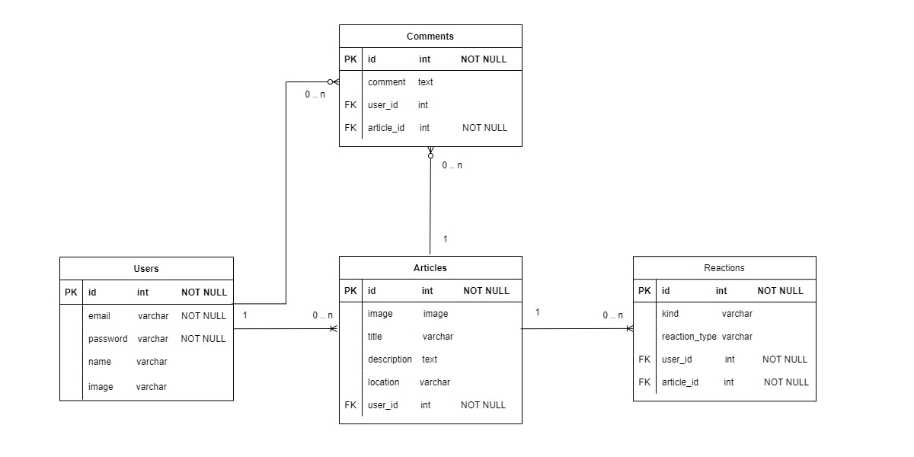

  

# Módulo 6 - Desafío 3
# Carlos Santana

Ruby on Rails - postgresql

## Descripción

Esta aplicación realiza, usando el modelo de un blog, publicaciones, comentarios  y likes a los artículos. Adicionalmente, tiene control de acceso (LogIn, LogOut, SignUp y editUser ) para publicar y dar likes; y está libre para comentar (no requiere ser usuario registrado).  
  
OBS:  
    - El usuario puede subir una imagen en su registro.  
    - El artículo permite subir una imagen para ilustrarlo.  
    - Los artículos se muestran en orden descendiente según la fecha de creación del mismo.  
    - La aplicación permite determinadas vistas según el perfil del usuario. Sólo el usuario registrado puede crear artículos.  
    - No se permite editar artículos, ya que los likes o dislikes son para el artículo que ve un usuario. Por lo tanto, si se cambia su contenido, los likes o dislikes ya no serán -necesariamente- para el articulo editado.  
    - En esta versión no se permite eliminar un artículo.  
    - Si se desea cambiar los datos del usuario, éste debe hacer click sonbre su nombre en la barra de navegación y lo lleva a la vista de modificación.  
  
## Modelo de datos  
  

  
## Inicio
  
Estas instrucciones te ayudarán a obtener una copia del proyecto y a ejecutarlo en tu máquina local para fines de desarrollo y prueba.

### Pre-requisitos
  
Este proyecto fue desarrollado con Ruby versión 3.3.5, Rails - versión 7.2.1.1 y PostgreSQL - versión 16.4

### Instalación
  
Sigue estos pasos para ejecutar el proyecto localmente:
  
1. Clona este repositorio en tu máquina local.  
git clone https://github.com/crsantanag/m6d3.git  
  
2. Navega hasta el directorio del proyecto.  
cd m6d3  
  
3. Instala las dependencias y modifica archivo database.yml  
Las gemas que se deben instalar son:  
   - faker (crea datos ficticios)  
   - pagy  (paginación)   
   - devise (autenticación)  
   - activestorage (almacenamiento de imágenes)
     rails active_storage:install

  
4. Crea la base de datos, realiza la migración y carga los datos de prueba (ejecutar archivo seed.rb)  
    - rails db:create  
    - rails db:migrate  
    - rails db:seed ( seed.rb tiene la creación del usuario user@crazy4cats.cl - revisar antes de ejecutar el comando )   

## Ejecutando las pruebas
Levanta el servidor y prueba la aplición.  
root está en /  
  
Este proyecto no cuenta con pruebas automatizadas. Puedes probar manualmente todas las funcionalidades.  
  
## Licencia  
  
Este proyecto está bajo la Licencia MIT. Consulta el archivo [LICENSE.md](LICENSE.md) para obtener más detalles.  
  
⌨ ️Carlos Santana (https://github.com/crsantanag)

